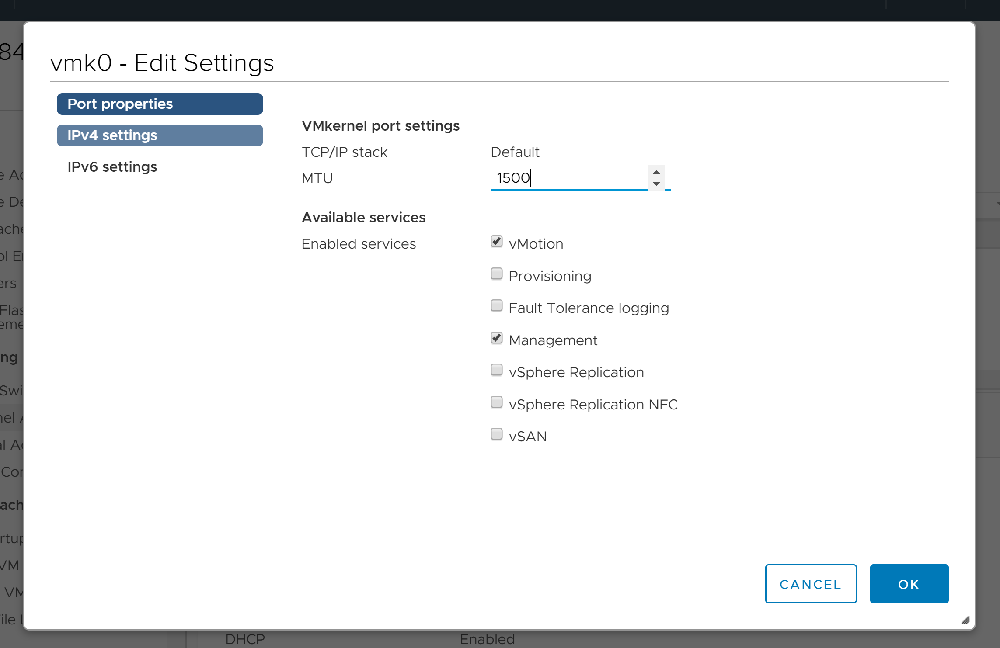

# ESX Maximum transmission unit fixer

This is a remidiation function which will be triggered when a VM is powered on. It will make sure that the Maximum transmission unit of the VM Kernel Adapter on all ESX hosts is at least `1500`. You can find out more about why `1500` is an optimal value in the [wikipedia page](https://en.wikipedia.org/wiki/Maximum_transmission_unit).

## Set up

Prerequisites are :
* Binary [faas-cli](https://docs.openfaas.com/cli/install/)
* [VEBA](https://flings.vmware.com/vcenter-event-broker-appliance?download_url=https%3A%2F%2Fdownload3.vmware.com%2Fsoftware%2Fvmw-tools%2Fveba%2FvCenter_Event_Broker_Appliance_0.1.0.ova#summary) or [OpenFaaS](https://docs.openfaas.com/deployment/kubernetes/) and [vcenter-connector](https://github.com/openfaas-incubator/vcenter-connector) on top of [kubernetes](https://kubernetes.io/docs/setup/learning-environment/minikube/). It is preferred to go with VEBA as it is single installation.
* Deployed arbitrary VM on your vCenter to trigger the function when the VM is powered on.

The function needs credentials and endpoint of the vCenter with which the function will interact. You can see how to create a secret containing those credentials in your kubernetes cluster in the [create_secret](./create_secret.sh) script. Your `kubectl` must be configured to communicate with your remote cluster first.

## Deploy the function

Login to the gateway:
```
export OPENFAAS_URL=https://VEBA_FQDN_OR_IP

faas-cli login -p VEBA_OPENFAAS_PASSWORD --tls-no-verify
```

From inside the `esx-mtu-fixer` folder run:
```
faas-cli deploy --tls-no-verify
```

## Try it out

Before you start deploy arbitrary VM on one of your ESX hosts.

### Lower the MTU

* Navigate to one of your ESXi hosts and in `Configure` tab navigate to `Networking` and find `VMkernel Adapters`:


* Pick a device and press `Edit`(blue dot) and a window will appear:


* Change the value so it is smaller than `1500` and press OK.

### Fix the MTU

* Trigger `vm.powered.on` event, by powering on a VM.
> Note for DRS-enabled clusters the event should be `drs.vm.powered.on`
* Navigate to the same place to see the MTU is back to `1500`

