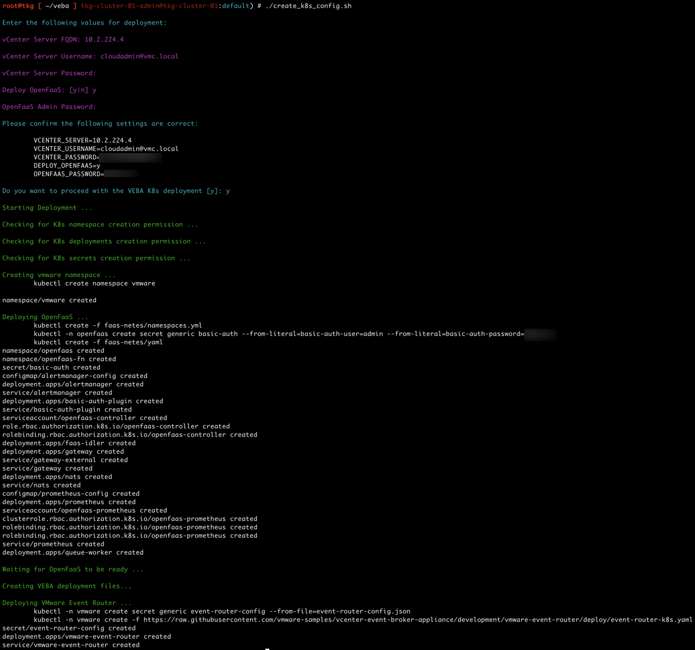
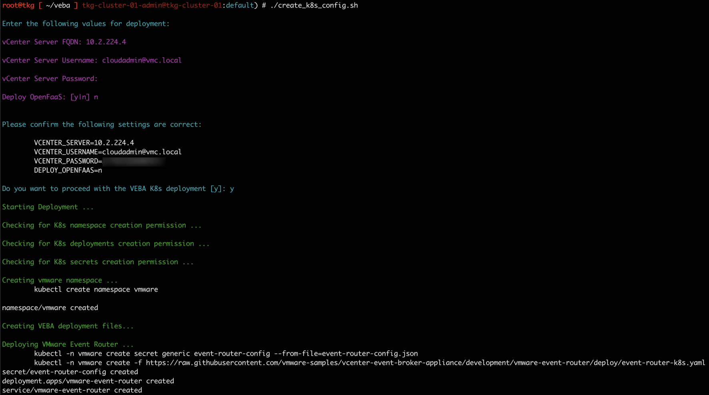

# Deploy VMware Event Broker Application to existing Kubernetes Cluster

For customers with an existing Kubernetes ("K8s") cluster, you can deploy the underlying components that make up the VMware Event Broker Appliance. The instructions below will guide you in downloading the required files and using the `create_k8s_config.sh` shell script to aide in deploying the VEBA K8s application.

The script will prompt users for the required input and automatically setup and deploy both OpenFaaS and the VMware Event Router components giving you a similar setup like the VMware Event Broke Appliance. If you have already deployed OpenFaaS, you can skip that step during the script input phase.

## Pre-Req:
* Ability to create namespaces, secrets and deployments in your K8s Cluster using kubectl
* Outbound connectivity or access to private registry from the K8s Cluster to download the required containers to deploy OpenFaaS and/or VMware Event Router

## Deploy VMware Event Router and OpenFaaS

### Install

Step 1 - Clone the OpenFaaS to your local system

```
git clone https://github.com/openfaas/faas-netes
```

Step 2 - Change into the `faas-netes` directory and checkout version `0.9.2` which has been tested with VEBA and then change back to previous working directory.


```
cd faas-netes
git checkout 0.9.2
cd ..
```

Step 3 - Download the `create_k8s_config.sh` script and ensure it has executable permission (`chmod +x create_k8s_config.sh`).

Step 4 - Run the `create_k8s_config.sh` script which will prompt for vCenter Server address (FQDN/IP Address), the vCenter Server username and password which is authorized to retrieve vCenter Server Events (readOnly role is sufficient) and the admin password for OpenFaaS. Prior to deploying, you will be asked to confirm the input in case you need to change it.

```
./create_k8s_config.sh
```

Here is an example of what you should see if the deployment was successful:



Step 5 - Ensure that all pods are running in both OpenFaaS and VMware namespace:

```
# kubectl get pods -n openfaas
NAME                                 READY   STATUS    RESTARTS   AGE
alertmanager-bdf9db7b9-ldwkz         1/1     Running   0          27s
basic-auth-plugin-665bf4d59b-f87rm   1/1     Running   0          27s
faas-idler-f4597f655-pr5tq           1/1     Running   0          27s
gateway-cdf7b89fb-7589b              2/2     Running   1          27s
nats-8455bfbb58-j4wpm                1/1     Running   0          27s
prometheus-688d9cfbf7-wkvc9          1/1     Running   0          26s
queue-worker-649bdf958f-k55g2        1/1     Running   0          27s
```


```
# kubectl get pods -n vmware
NAME                                   READY   STATUS    RESTARTS   AGE
vmware-event-router-6744cc6447-xbpmn   1/1     Running   1          42s
```

To retrieve the OpenFaaS Gateway IP Address for function deployment, run the following command:

```
kubectl -n openfaas describe pods $(kubectl -n openfaas get pods | grep "gateway-" | awk '{print $1}') | grep "^Node:" | awk -F "/" '{print $2}'
```

**Note:** If you don't use an Ingress controller, load-balancer or other means to expose your Kubernetes deployments (services), then the default OpenFaaS endpoint is `http://<worker-ip>:31112`

### Uninstall

To remove the VEBA and OpenFaaS K8s application, run the following commands:

```
kubectl delete ns vmware
kubectl delete -f faas-netes/yaml
kubectl delete -f faas-netes/namespaces.yml
```

## Deploy only VMware Event Router

Step 1 - Download the `create_k8s_config.sh` script and ensure it has executable permission (`chmod +x create_k8s_config.sh`).

Step 2 - Run the `create_k8s_config.sh` script which will prompt for vCenter Server address (FQDN/IP Address), the vCenter Server username and password which is authorized to retrieve vCenter Server Events (readOnly role is sufficient). Prior to deploying, you will be asked to confirm the input in case you need to change it.

```
./create_k8s_config.sh
```

Here is an example of what you should see if the deployment was successful:



Step 3 - Ensure the VMware Event Router pod is running in the VMware namespace:

```
# kubectl get pods -n vmware
NAME                                   READY   STATUS    RESTARTS   AGE
vmware-event-router-6744cc6447-xbpmn   1/1     Running   1          42s
```

## Uninstall:

To remove the VMware Event Router K8s application, run the following command:

```
kubectl delete ns vmware
```